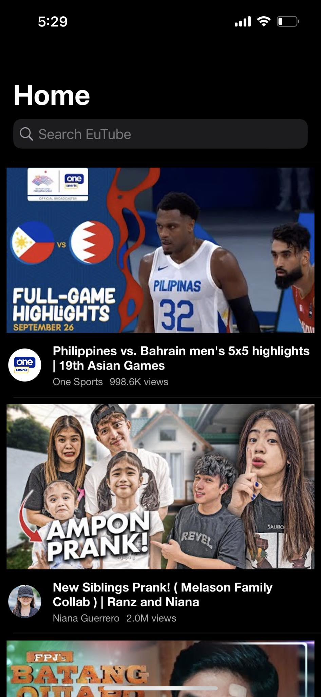
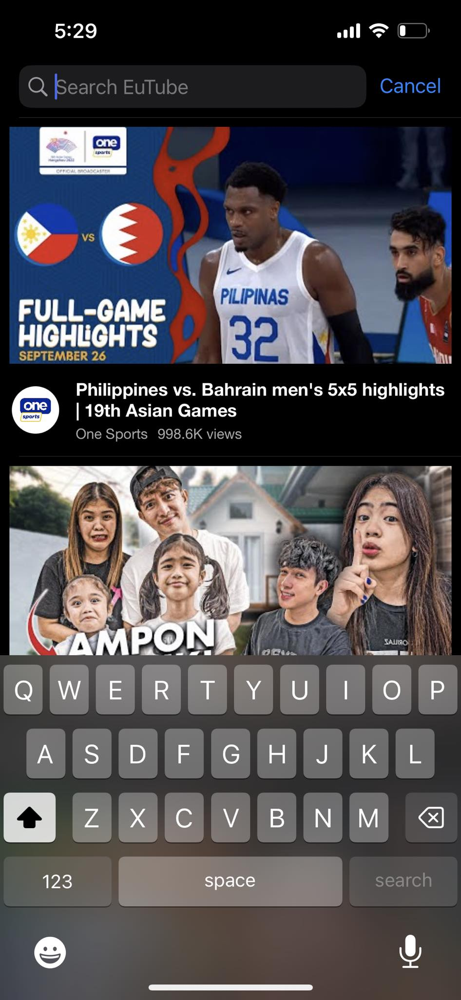
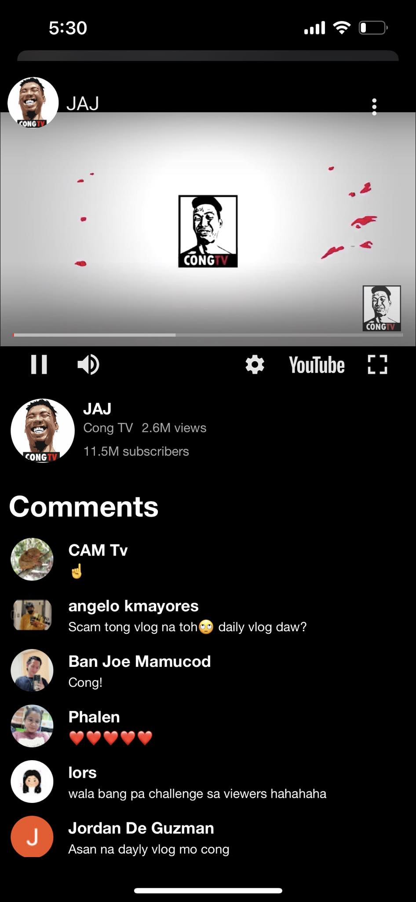

# mobileTest

# UI

The app's UI is a simple prototype of youtube.

Home/Trending List            |  Search State                  |    Datails Screen  
:-------------------------:|:-------------------------: |:-------------------------:
  |   | 

# Architecture: Combine-MVVM-C

The architectural pattern I used in this app is Comebine-MVVM-C.
I used this architecture because aside from it is what I'm used to, this architecture clearly distributes the responsibilities of each classes.

- Model = handles all data objects
- View = handles all UI or what the user's see and interacts with
- ViewModel = notifies the View if there's any changes in the Model
- Coordinator = handles the navigation between views/screens

# Libraries
  - AlamofireImage = for loading images
  - R.swift = for auto completes
  - youtube-ios-player-helper = for youtube player
  - ProgressHUD = for loading/progress popups
  - Wormholy = for network debugging
